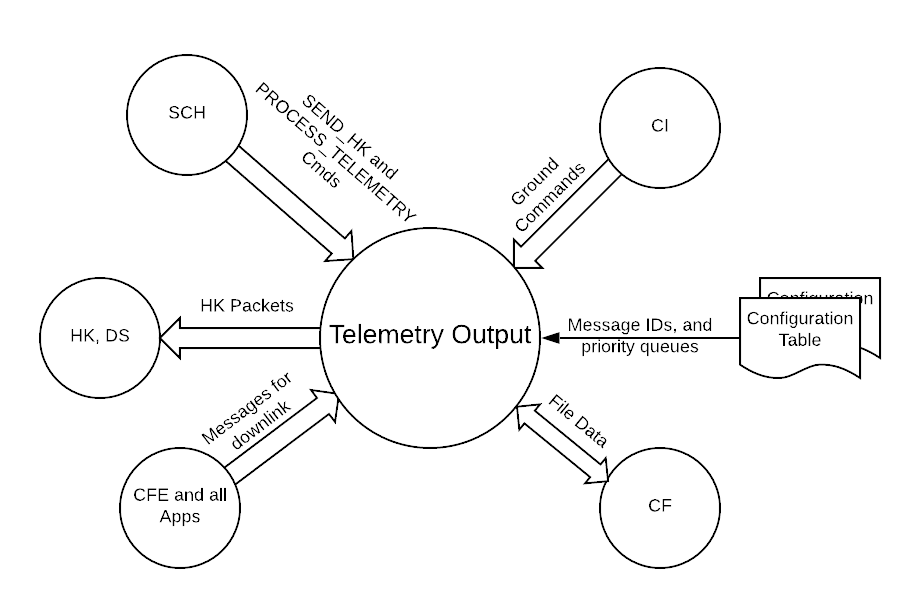
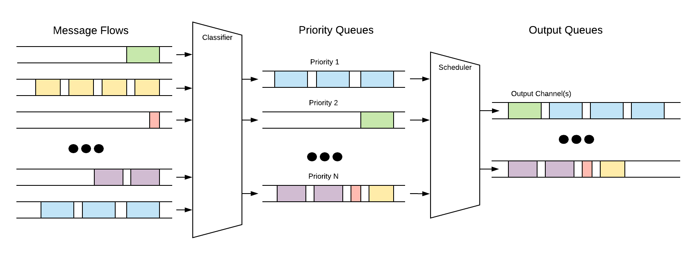
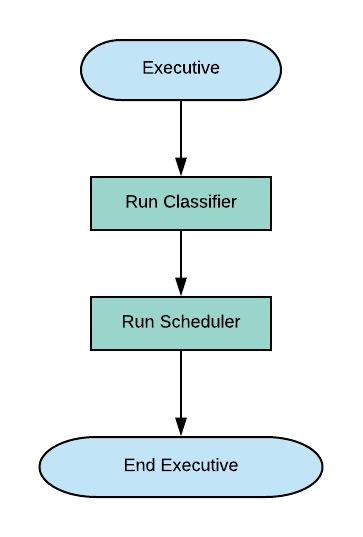
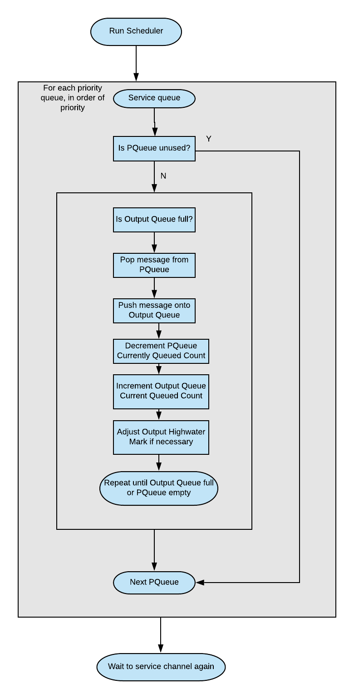

# Telemetry Output (TO) Introduction

***
## Table of Contents

* [TO Acronyms](#to-acronyms)
* [TO Overview](#to-overview)
  * [TO Activities](#to-activities)
  * [TO Structure](#to-structure)
* [TO Documentation](#to-documentation)
  * [TO Operation](#to-operation)
  * [TO Requirements](#to-requirements)
  * [TO Deployment Guide](#to-deployment-guide)
  * [TO Commands](#to-commands)
  * [TO Tememetry](#to-telemetry)
  * [TO Table Definitions](#to-table-definitions)
  * [TO Configuration Parameters](#to-configuration-parameters)
  * [TO Operational Constraints](#to-operational-constraints)
  * [TO FAQs](#to-faqs)
  * [TO Event Message Reference](#to-event-message-reference)

***
## TO Acronyms

The following table provides complete specification for the commands and telemetry associated with the TO Application (TO) software:

| Acronym | Description                                             |
| ------- | ------------------------------------------------------- |
| API     | Application Programming Interface                       |
| CCSDS   | Consultative Committee for Space Data Systems           |
| C&DH    | Command and Data Handling                               |
| CFE     | Core Flight Executive                                   |
| CFS     | Core Flight System                                      |
| Cmd     | Command                                                 |
| CPU     | Central Processing Unit                                 |
| FSW     | Flight Software                                         |
| HK      | Housekeeping telemetry, or CFS Housekeeping Application |
| HW, H/W | Hardware                                                |
| ICD     | Interface Control Document                              |
| ISR     | Interrupt Service Routine                               |
| OS      | Operating System                                        |
| OSAL    | Operating System Abstraction Layer                      |
| Pkts    | Packets                                                 |
| RAM     | Random-Access Memory                                    |
| RTOS    | Real Time Operating System                              |
| SB      | Software Bus Service                                    |
| SW, S/W | Software                                                |
| TBD     | To Be Determined                                        |
| TBL     | Table                                                   |
| TLM     | Telemetry                                               |
| UTC     | Universal Coordinated Time (time scale)                 |

***
## TO Overview

The TO Application (TO) application subscribes to and transmits  Consultative Committee for Space Data Systems (CCSDS) Space Packet  Protocol Telemetry packets from the cFE Software Bus to output media.  The specifics of the output media are handled by the platform specific  TO custom layer, contained within the build configuration.

### TO Activities:

Process Telemetry

* Implements prioritized class based filtering to make maximum use of limited bandwidth.

* Messages are classified into priority based queues when scheduled by the Scheduler application.

* Messages are dequeued by the TO Scheduler and written to the output  port as the output port is available to be written to and as messages  are available to be dequeued.

* Lower priority queues are only served when the higher priority queues are empty.

* Telemetry maximum rate groups are defined by the SCH application configuration but can be preempted by higher priority messages.

The main loop, besides processing commands, calls **TO_Classifier_Run()** and **TO_Scheduler_Run()** for each channel. Each channel has 1 Classifier, 1 Scheduler, and 1 Output Queue but can have multiple message definitions (aka Message Flows) and Priority Queues. The rate this process executes depends on the rate that the #TO_SEND_TLM_MID message is scheduled at in the Scheduler configuration table. If the TO_SEND_TLM_MID is scheduled at a rate of 2Hz, this function will execute at approximately 500ms intervals.

This process sorts the incoming messages into Priority Queues. A message can be routed to one and only one Priority Queue. If you decide to change the Priority Queue assignment, you must either load a new configuration table or send a command to remove the Message Flow and readd the Message Flow with the new Priority Queue assignment. This classifying of messages into Priority Queues is what provides the priority based classification. All messages within a Priority Queue have the same priority. Within a Priority Queue, the order the messages are transmitted is based on the order the message was received in the Message Flow pipe. The purpose of the classification will appear clearer in the next step.

### TO Structure:

TO consists of 1 to n (configurable) channels and each channel is  independent of the other channels. Even if the channels are configured  to handle the same message identifier, the channels can handle the the  message in different ways. The channels employ an output queue. It is TO's job is to subscribe to messages from the cFE Software Bus and put  them into the appropriate priority queues. Messages are taken from the  priority queues in priority order and put onto the output queue where  they are sent to the corresponding TO output channel device. 

***
## TO Documentation

### TO Operation:

Description of what this file covers here
[TO_Operation.md](docs/TO_Operation.md "Link to TO Operation")

### TO Requirements:

Description of what this file covers here
[TO_Requirements.md](docs/TO_Requirements.md "Link to TO Requirements")

### TO Deployment Guide:

Description of what this file covers here
[TO_Deployment_Guide.md](docs/TO_Deployment_Guide.md "Link to TO Deployment Guide")

### TO Commands:

Description of what this file covers here
[TO_Commands.md](docs/TO_Commands.md "Link to TO Commands")

### TO Telemetry:

Description of what this file covers here
[TO_Telmemetry.md](docs/TO_Telmemetry.md "Link to TO Telemetry")

### TO Table Definitions:

Description of what this file covers here
[TO_Table_Definitions.md](docs/TO_Table_Definitions.md "Link to TO Table Definitions")

### TO Configuration Parameters:

Description of what this file covers here
[TO_Configuration_Parameters.md](docs/TO_Configuration_Parameters.md "Link to TO Configuration Parameters")

### TO Operational Constraints:

Description of what this file covers here
[TO_Operational_Constraints.md](docs/TO_Operational_Constraints.md "Link to TO Operational Constraints")

### TO FAQs:

Description of what this file covers here
[TO_FAQs.md](docs/TO_FAQs.md "Link to TO FAQs")

### TO Event Message Reference:

Description of what this file covers here
[TO_Event_Message_Reference.md](docs/TO_Event_Message_Reference.md "Link to TO Event Message Reference")

