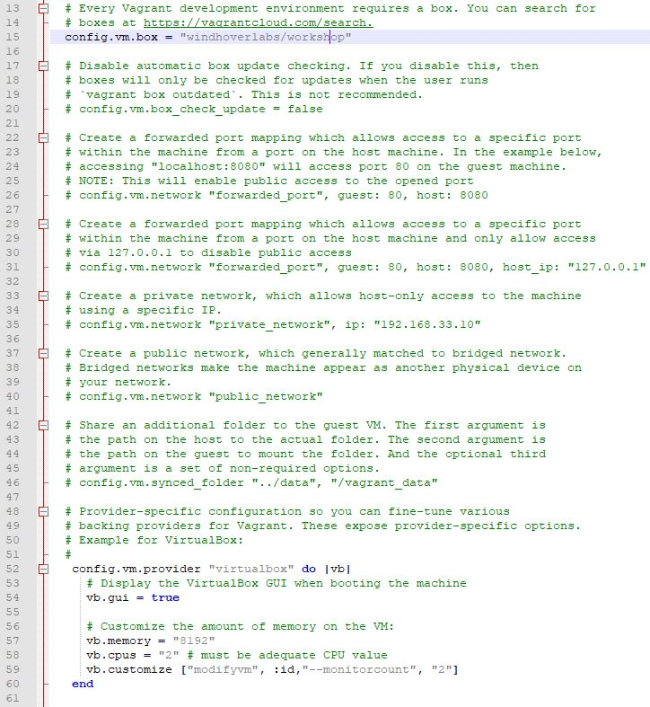

# Airliner Setup in Linux
***
## Assumptions for the use of Airliner:
***
* User can navigate Windows Command Prompt
* User is familiar with navigating Linux Shells
* User is comfortable using git and navigating GitHub
* VirtualBox and Vagrant are installed

***
## Required Versions:
***
* VirtualBox 5.1.38
* Vagrant 2.2.9
* Ubuntu 16.04
* Java 11.0.2

***
## VirtualBox setup in Windows:
***

1. Download [VirtualBox 5.1.38](https://www.virtualbox.org/wiki/Download_Old_Builds_5_1 "VirtualBox 5.1.38")
2. Download [Vagrant 2.2.9](https://www.vagrantup.com/downloads "Vagrant 2.2.9") and follow [installation instructions](https://www.vagrantup.com/docs/installation)
2. Within Windows, create a directory for your environment
3. Within that directory perform a `vagrant init`
4. Open the newly generated Vagrantfile in a text editor and uncomment/edit the following lines: 

Line 15 of Vagrantfile:

<pre><code>config.vm.box = "windhoverlabs/workshop"</code></pre>

Lines 52-58 of Vagrantfile:

<pre><code>config.vm.provider "virtualbox" do |vb|
            # Display the VirtualBox GUI when booting the machine
            vb.gui = true
            # Customize the amount of memory on the VM (half of system memory is reccomended):
            vb.memory = 
end</code></pre>

When finished the editied Vagrantfile should appear similar to the image below:

5. Perform a `vagrant up` at destination of Vagrantfile

	**NOTE:** This command must be run **ANY TIME** that you want to boot up the Virtual Machine

***
## Airliner Initial Install & Setup:
***

1. Ensure the auto update feaure is off in Ubuntu as this has been known to cause version conflicts with Airliner
2. <pre><code>$ ssh-keygen</code></pre>
3. <pre><code>$ cd .ssh</code></pre>
4. Navigate to the file below, open within a text editor, and copy everything within this file <pre><code>$~/.ssh$ vim id_rsa.pub </code></pre> 
5. Create a new SSH key on your personal Github and paste the entirety of what was in the previous file
6. Go to Windhover Lab's Airliner repository and get an SSH key
7. Create or navigate to your git directory in your terminal
8. <pre><code>$~/git$ git clone git@github.com:WindhoverLabs/airliner.git</code></pre>
9. <pre><code>$~/git$ cd airliner/tools/commander/</code></pre>
10. <pre><code>$~/git/airliner/tools/commander$ npm install</code></pre>

The following npm warnings are expected:

11. To show all the options of targets available to make <pre><code>$~/git/airliner$ make</code></pre> 

The following options are the targets currently available to make:

***
## Airliner Target Insallation & Simulation for bebop2/sitl
***
1. <pre><code>$~/git/airliner$ make bebop2/sitl </code></pre>
2. <pre><code>$~/git/airliner$ cd build/bebop2/sitl </code></pre>
3. <pre><code>$~/git/airliner/build/bebop2/sitl$ make ground_tools</code></pre>
4. Open three terminals starting at the following location <pre><code>$~/git/airliner/build/bebop2/sitl$ </code></pre> 

### Terminal 1: Simulation

1. <pre><code>$~/git/airliner/build/bebop2/sitl$ cd host/ </code></pre>
2. **Simulate using Gazebo 8**: At the moment this option is too slow to run in a VM, but feel free to try it 
<pre><code>$~/git/airliner/build/bebop2/sitl/host$ ./start-gazebo</code></pre> 
3. **Simulate using Jmavsim**: This option should always work 
<pre><code>$~/git/airliner/build/bebop2/sitl/host$ ./start-jmavsim</code></pre> 

Your jmavsim simulation should look as follows if working properly:

### Terminal 2: Ground System
1. <pre><code>$~/git/airliner/build/bebop2/sitl$ make start-commander</code></pre>
2. Open a web browser within Virtual Box and go to [http://localhost:3000](http://localhost:3000 "localhost:3000") for the commander interface

### Terminal 3: Flight Shell
1. <pre><code>$~/git/airliner/build/bebop2/sitl$ cd target/exe </code></pre>
2. <pre><code>$~/git/airliner/build/bebop2/sitl/target/exe$ ./airliner </code></pre>
